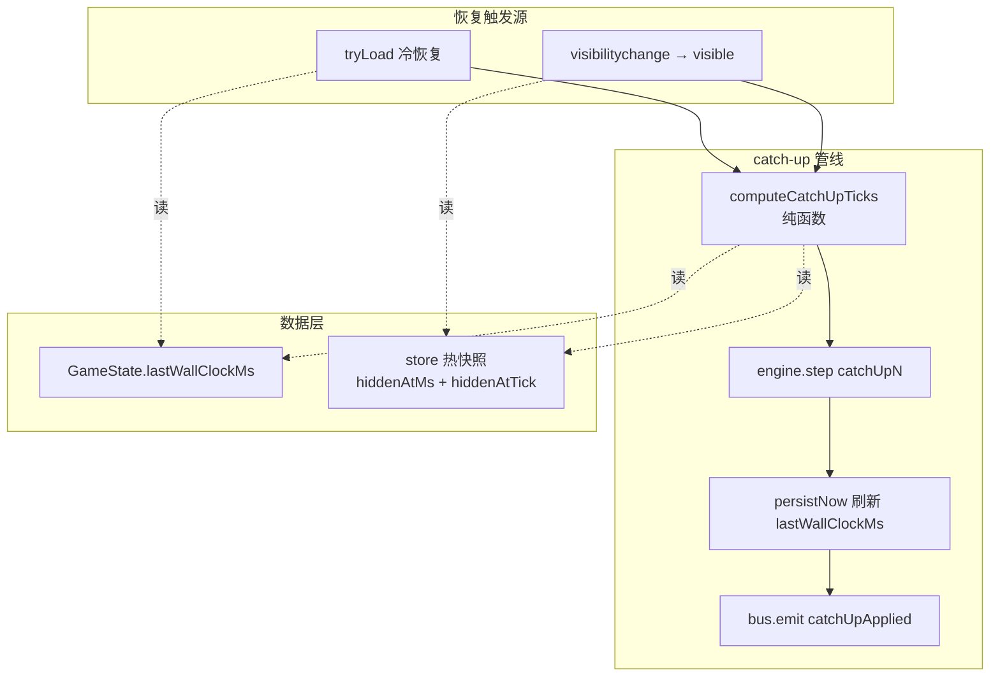

## 用户需求

实现前端切后台后的追帧（catch-up）机制，使游戏在标签页隐藏/最小化后恢复时，能根据真实流逝时间补跑缺失的逻辑 tick，同时统一冷恢复（读档）和热恢复（切后台回来）两条路径。

## 产品概述

为 tick-based idle 游戏添加离线/后台进度追赶能力。玩家切走标签页或关闭浏览器后再回来时，游戏自动计算缺失时间并同步补跑游戏逻辑，确保不丢失任何进度，上限 24 小时。

## 核心特性

- 在 `GameState` 中新增 `lastWallClockMs` 字段，每次存档时记录真实时间戳
- 新增纯函数 `computeCatchUpTicks`：根据 wall clock 差值、逻辑 tick 差值、速度倍率计算需要补跑的 tick 数量，含 24 小时上限和防双算
- 在 Store 层监听 `visibilitychange` 事件，页面隐藏时快照 wall clock + logic tick，恢复可见时调用 `engine.step(missingTicks)` 补跑缺口
- 冷恢复（读档）时从 `lastWallClockMs` 计算离线时长并补跑
- 离线/后台追帧永远按 1x 速度计算，不受当前 UI 倍率影响
- 追帧后立即存档，记录追帧结果
- 新增 `catchUpApplied` 总线事件，供 dev 日志和未来 UI 提示使用
- 配套确定性单测：验证 catch-up 计算纯函数、连续跑 vs 追帧状态等价性、战斗/采集中追帧正确性

## 技术栈

- 语言：TypeScript（现有）
- 运行时：Bun（测试）、Vite（开发/构建）
- 框架：React 18（UI 层）
- 测试：bun test（现有）

## 实现方案

### 核心策略

采用"恢复时补 tick"而非"后台持续运行"的方案。不引入 Web Worker，理由是浏览器对后台标签页的定时器节流行为不可靠且跨浏览器不一致，而 `engine.step(n)` 已经是同步确定性补跑入口，天然适合追帧场景。

### 关键技术决策

1. **wall clock 记录位置**：放在 `GameState` 中作为持久化字段 `lastWallClockMs`，这样冷恢复和热恢复共享同一个时间基准。

2. **追帧计算抽为纯函数**：`computeCatchUpTicks(params)` 完全无副作用，接受 wall clock 差值、logic tick 差值、TICK_MS 等参数，返回需补跑的 tick 数。这样可以在 bun test 中精确测试所有边界条件，不依赖浏览器环境。

3. **补缺口而非盲补**：追帧公式为 `missingTicks = expectedTicks - actuallyAdvanced`，其中 `expectedTicks = Math.floor(elapsedMs / TICK_MS)`，`actuallyAdvanced = currentTick - snapshotTick`。后台期间浏览器可能仍然节流地推进了一些 tick，此公式确保不会双算。

4. **速度倍率政策**：追帧永远按 1x 速度计算。理由：(a) 当前 `speedMultiplier` 没有可靠持久化到 `GameState`，只存在于 runtime engine 上；(b) Alpha 期追求语义清晰，避免"离线 2 小时按 4x 补 = 8 小时进度"这种反直觉行为。

5. **上限**：wall clock cap = 24 小时 = 86_400_000 ms；对应 tick cap = 864_000（10Hz x 24h）。两个 cap 同时生效取较小值。

6. **save version bump**：`SAVE_VERSION` 从 5 升到 6，新增 migration 为旧存档补上 `lastWallClockMs: Date.now()` 默认值。

7. **生命周期钩子**：在 `store.ts` 中监听 `document.visibilitychange`，`hidden` 时快照 `{ wallClockMs, logicTick }`，`visible` 时计算缺口并调用 `engine.step()`。同时在 `persistNow` 中更新 `lastWallClockMs`。

### 实现注意事项

- **追帧期间抑制 UI 通知**：补跑大量 tick 时 `__ui_notifier` 会随之触发大量 revision bump。由于 `engine.step(n)` 是同步的，React 在此期间不会重渲染（JS 单线程），所以不存在性能问题——只是 revision 数值会跳跃，这是可接受的。如果未来补跑量极大导致主线程卡顿，再引入 chunked catch-up 或 worker，但当前 Alpha 期不做。

- **`lastWallClockMs` 更新时机**：在 `persistNow()` 中写入 `state.lastWallClockMs = Date.now()`，确保每次存档都刷新。`createEmptyState` 中初始化为 `Date.now()`。

- **冷恢复路径**：在 `tryLoad` 成功调用 `loadFromSave` 后，读取 `loaded.lastWallClockMs`，结合 `Date.now()` 和 `loaded.tick` / `engine.currentTick` 计算追帧量并 `engine.step()`。

- **`Date.now` 可注入**：`computeCatchUpTicks` 接受 `nowMs` 参数而非内部调用 `Date.now()`，确保测试可控。Store 层的 `createGameStore` 也可以通过 options 注入 `now` 函数（可选，测试时覆盖）。

- **事件总线扩展**：在 `GameEvents` 中新增 `catchUpApplied: { elapsedMs, appliedTicks, wasCapped }` 事件，追帧完成后 emit，供日志和未来 UI 使用。

## 架构设计



## 目录结构

```
src/core/
├── tick/
│   └── index.ts              # [MODIFY] 导出 TICK_MS 常量（已有），无需改动
├── tick/
│   └── catch-up.ts           # [NEW] computeCatchUpTicks 纯函数 + CatchUpParams 类型 + MAX_CATCHUP_MS / MAX_CATCHUP_TICKS 常量。负责根据 wall clock 差、logic tick 差计算需补跑的 tick 数，含上限裁剪和非负保护。
├── state/
│   └── types.ts              # [MODIFY] GameState 接口新增 lastWallClockMs: number 字段；createEmptyState 初始化该字段为 Date.now()
├── save/
│   ├── migrations.ts         # [MODIFY] SAVE_VERSION 从 5 升到 6；新增 v5→v6 migration 为旧存档补上 lastWallClockMs 默认值
│   └── serialize.ts          # [MODIFY] 无需显式改动（lastWallClockMs 作为 GameState 顶层字段会被 JSON.stringify 自动包含），但需确认 deserialize 路径兼容
├── events/
│   └── index.ts              # [MODIFY] GameEvents 类型新增 catchUpApplied 事件
├── session/
│   └── index.ts              # [MODIFY] GameSession 接口无需改动；state getter 中补充 lastWallClockMs 同步（类似现有 tick/rngState 同步）
src/ui/
└── store.ts                  # [MODIFY] 核心改动：(1) visibilitychange 监听 + 热快照；(2) tryLoad 后冷恢复追帧；(3) persistNow 中更新 lastWallClockMs；(4) CreateGameStoreOptions 可选注入 now 函数
tests/core/
├── catch-up.test.ts          # [NEW] computeCatchUpTicks 纯函数单测：零隐藏、短隐藏、长隐藏、超 cap、后台已有部分推进、负值保护
├── catch-up-integration.test.ts  # [NEW] 集成测试：连续运行 vs 追帧后状态等价性；战斗中追帧；采集中追帧
docs/
├── modules/
│   ├── infrastructure.md     # [MODIFY] 补充 catch-up 模块说明
│   └── save.md               # [MODIFY] 补充 lastWallClockMs 字段说明
└── roadmap.md                # [MODIFY] 标记"离线追进度"为已完成
```

## 关键代码结构

```typescript
// src/core/tick/catch-up.ts

/** 追帧所需的所有输入，全部从外部传入，确保纯函数可测试 */
export interface CatchUpParams {
  /** 上一次记录的 wall clock（来自存档或热快照） */
  lastWallClockMs: number;
  /** 当前 wall clock */
  nowMs: number;
  /** 上一次记录的逻辑 tick（来自存档或热快照） */
  lastLogicTick: number;
  /** 当前引擎逻辑 tick */
  currentLogicTick: number;
  /** 每个逻辑 tick 对应的毫秒数 */
  tickMs: number;
}

export interface CatchUpResult {
  /** 需要补跑的 tick 数量 (>= 0) */
  ticksToApply: number;
  /** 原始 wall clock 经过的毫秒数 */
  elapsedMs: number;
  /** 是否被上限裁剪 */
  wasCapped: boolean;
}

export function computeCatchUpTicks(params: CatchUpParams): CatchUpResult;
```